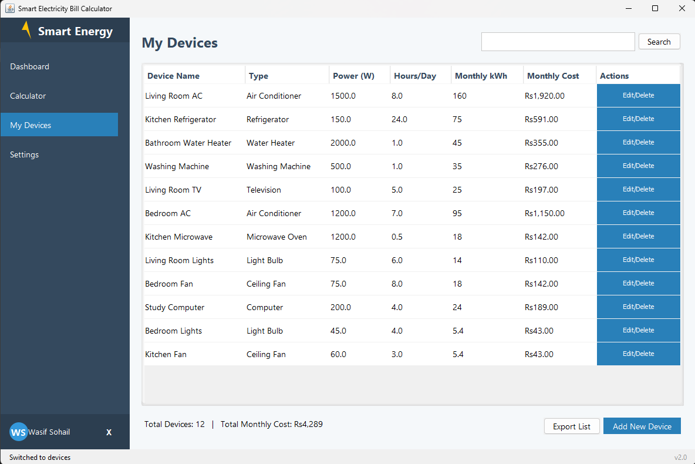

# ⚡ Smart Electricity Bill Calculator


<p align="center">
  
</p>

> An intelligent desktop application for calculating and visualizing electricity consumption with customizable tariffs, device management, and energy-saving recommendations.

## 📋 Table of Contents
- [Features](#-features)
- [Project Overview](#-project-overview)
- [Tools & Technologies](#-tools--technologies)
- [Workflow & Architecture](#-workflow--architecture)
- [Screenshots](#-screenshots)
- [Installation & Setup](#-installation--setup)
- [Usage Guide](#-usage-guide)
- [Future Enhancements](#-future-enhancements)
- [Contributing](#-contributing)
- [License](#-license)

## ✨ Features

<p align="center">
  
</p>

- **🧮 Advanced Billing Calculation**
  - Tiered rate system based on Pakistan's electricity tariff structure
  - Automatic tax and surcharge calculations
  - Multi-currency support (PKR, USD, EUR, GBP)
  - Historical bill comparison

- **📱 Modern UI/UX Design**
  - Sleek, responsive interface with animations
  - Card-based dashboard with key metrics
  - Interactive charts and visualizations
  - Dark/Light theme support

- **🔌 Device Management**
  - Add and track individual electrical appliances
  - Calculate per-device electricity consumption
  - Identify high-consumption devices
  - Usage patterns and optimization suggestions

- **📊 Analytics & Reporting**
  - Monthly consumption trends
  - Cost breakdown visualization
  - Predictive usage forecasting
  - Exportable reports (PDF/CSV)

- **⚙️ Customization Options**
  - Editable electricity rates
  - Personalized user profiles
  - Configurable dashboard widgets
  - Notification preferences

## 🔍 Project Overview

The Smart Electricity Bill Calculator is a comprehensive desktop application designed to help users understand, manage, and optimize their electricity consumption. Built with Java Swing, the application offers a modern interface that rivals web applications while providing the reliability and performance of a native desktop application.

The application addresses the complex electricity billing structure in Pakistan, where rates change based on consumption tiers, fuel adjustments, taxes, and other factors that make manual calculation challenging. Beyond simple bill calculation, it provides insights into usage patterns and offers practical energy-saving recommendations.

## 🛠 Tools & Technologies

<p align="center">
  
</p>

- **Core Development**
  - Java SE 17
  - Swing/AWT for UI components
  - Custom UI extensions for modern appearance

- **Data Visualization**
  - JFreeChart for graphs and charts
  - Custom rendering for specialized visualizations
  - Animation utilities for interactive displays

- **Data Management**
  - Local file-based storage using serialization
  - Properties-based configuration management
  - Custom data models for business logic

- **Design & Assets**
  - Custom-designed icons and graphics
  - Color schemes based on material design principles
  - Responsive layout management

## 📊 Workflow & Architecture

<p align="center">
  
</p>

### Application Architecture

```
┌─────────────────────────────────────────────┐
│                                             │
│                Presentation Layer           │
│  ┌─────────┐  ┌─────────┐  ┌─────────────┐  │
│  │Dashboard │  │Calculator│  │Device Mgmt │  │
│  └─────────┘  └─────────┘  └─────────────┘  │
│         ┌─────────┐  ┌─────────────┐        │
│         │ Reports │  │  Settings   │        │
│         └─────────┘  └─────────────┘        │
└───────────────────┬─────────────────────────┘
                    │
┌───────────────────▼─────────────────────────┐
│                                             │
│                Business Logic Layer         │
│  ┌─────────────┐  ┌─────────────────────┐   │
│  │Rate Engine  │  │Consumption Analyzer │   │
│  └─────────────┘  └─────────────────────┘   │
│  ┌─────────────┐  ┌─────────────────────┐   │
│  │Tax Calculator│ │Prediction Engine    │   │
│  └─────────────┘  └─────────────────────┘   │
└───────────────────┬─────────────────────────┘
                    │
┌───────────────────▼─────────────────────────┐
│                                             │
│                  Data Layer                 │
│  ┌─────────────┐  ┌─────────────────────┐   │
│  │User Profiles│  │Device Registry      │   │
│  └─────────────┘  └─────────────────────┘   │
│  ┌─────────────┐  ┌─────────────────────┐   │
│  │Bill History │  │Rate Configuration   │   │
│  └─────────────┘  └─────────────────────┘   │
└─────────────────────────────────────────────┘
```

### User Flow

1. **Application Launch**
   - Splash screen displays while resources load
   - Authentication (if enabled)
   - Dashboard presentation

2. **Bill Calculation Flow**
   - Enter meter readings or consumption units
   - Select billing period
   - Apply appropriate tier rates
   - Calculate taxes and surcharges
   - Display itemized bill breakdown

3. **Device Management Flow**
   - Add device specifications
   - Input usage patterns
   - Calculate device-specific consumption
   - Receive optimization suggestions

4. **Settings & Customization**
   - Update electricity rates
   - Configure user preferences
   - Manage profile information
   - Set notification preferences

## 📸 Screenshots

<div align="center">
  
  &nbsp;&nbsp;&nbsp;
  
</div>
<br/>
<div align="center">
  
  &nbsp;&nbsp;&nbsp;
  
</div>
<br/>
<div align="center">
  
  &nbsp;&nbsp;&nbsp;
  
</div>

## 🚀 Installation & Setup

### Prerequisites
- Java Development Kit (JDK) 17 or higher
- 100MB of free disk space
- Minimum screen resolution: 1024x768

### Installation Steps

1. **Download the Application**
   ```bash
   git clone https://github.com/Wasif-Sohail55/ElectricityCalculator.git
   cd ElectricityCalculator
   ```

2. **Compile the Project**
   ```bash
   javac -d out src/*.java
   ```

3. **Run the Application**
   ```bash
   java -cp out Main
   ```

4. **Create Desktop Shortcut (Optional)**
   ```bash
   # For Windows:
   echo javaw -jar ElectricityCalculator.jar > ElectricityCalculator.bat
   
   # For Linux:
   echo 'java -jar ElectricityCalculator.jar' > electricity-calculator.sh
   chmod +x electricity-calculator.sh
   ```

## 📖 Usage Guide

### Quick Start

1. After launching, navigate to the "Calculator" section
2. Enter your meter reading or total consumed units
3. Select your consumer type (Residential/Commercial)
4. Click "Calculate" to see your estimated bill

### Advanced Features

- **Device Analysis**:
  1. Go to "My Devices" section
  2. Add your household appliances with their power ratings
  3. Set typical usage hours
  4. View consumption breakdown by device

- **Customizing Rates**:
  1. Navigate to "Settings"
  2. Update electricity rates for each consumption tier
  3. Save changes for future calculations

- **Dashboard Widgets**:
  1. Rearrange widgets using drag-and-drop
  2. Hide/show widgets via the dashboard settings
  3. Set update frequency for real-time widgets

## 🔮 Future Enhancements

<p align="center">
  
</p>

- **Smart Meter Integration** - Direct reading from supported smart meters
- **Mobile Companion App** - Synchronize data with Android/iOS devices
- **Renewable Energy Calculator** - Estimate savings from solar panel installation
- **Multi-Property Support** - Manage multiple properties with separate billing
- **AI-Powered Recommendations** - Machine learning for personalized energy-saving tips
- **Community Comparisons** - Compare usage with similar households
- **Appliance Database** - Expanded database of common electrical appliances and their typical consumption
- **Offline Mode** - Enhanced functionality when internet is unavailable
- **Cloud Backup & Sync** - Secure online backup of settings and history

## 👥 Contributing

Contributions are welcome! If you'd like to improve the Smart Electricity Bill Calculator, please:

1. Fork the repository
2. Create a feature branch (`git checkout -b feature/amazing-feature`)
3. Commit your changes (`git commit -m 'Add some amazing feature'`)
4. Push to the branch (`git push origin feature/amazing-feature`)
5. Open a Pull Request

## 📄 License

This project is licensed under the MIT License - see the LICENSE file for details.

---

<p align="center">
  Developed by <a href="https://github.com/Wasif-Sohail55">Wasif Sohail</a> | Last Updated: 2025-04-03
</p>

<p align="center">
  <i>Smart solutions for energy-conscious consumers</i>
</p>
